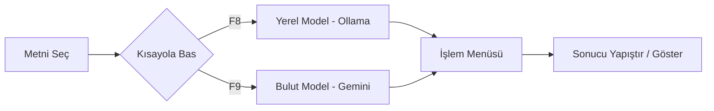

# 🚀 AI Assistant: Hybrid Clipboard Master

**Klavye kısayolları ile metinlerinizi saniyeler içinde yapay zeka ile dönüştürün.**

[Özellikler](#-özellikler) • [Kurulum](#-kurulum) • [Kullanım](#-kullanım-kılavuzu) • [Katkıda Bulunma](#-katkıda-bulunma)

---

## 📖 Projenin Amacı ve Özeti
**AI Assistant**, kullanıcının dijital çalışma akışını kesintiye uğratmadan, herhangi bir uygulama içerisindeki metinleri anında yapay zeka ile işlemesini sağlayan verimlilik odaklı bir araçtır. Proje, hem **yerel (local)** hem de **bulut (cloud)** tabanlı yapay zeka modellerini tek bir çatı altında birleştirerek, kullanıcının ihtiyacına göre hız, gizlilik veya yüksek zeka arasında seçim yapmasına olanak tanır.

Temel olarak, kopyala-yapıştır döngüsünü ortadan kaldırarak yapay zekayı doğrudan farenizin ucuna getirir.

---

## 🛠️ Uygulama Ne İşe Yarar?
Uygulama arka planda bir servis gibi çalışır ve klavyenizdeki belirli kısayolları (F8 ve F9) dinler.

### 🔄 Çalışma Akışı

Kullanım akışı şu şekildedir:
1. Herhangi bir programda (Tarayıcı, PDF, Word, vb.) bir metni seçersiniz.
2. **F8 (Yerel AI)** veya **F9 (Gemini)** tuşuna basarsınız.
3. Açılan şık menüden yapmak istediğiniz işlemi (Özetle, Kurumsala Çevir, Kalori Analizi vb.) seçersiniz.
4. AI, seçtiğiniz metni işler ve sonucu otomatik olarak seçili metnin yerine **yapıştırır** veya size sunar.

---

## 💡 İnsanlar Bunu Niye Kullansın?
*   **Zaman Tasarrufu:** Metni kopyalayıp tarayıcıya gitme, prompt yazma ve sonucu geri getirme zahmetinden kurtarır.
*   **Gizlilik ve Güvenlik:** F8 (Ollama) entegrasyonu sayesinde hassas verileriniz internete çıkmadan, tamamen kendi bilgisayarınızda işlenir.
*   **Özelleşmiş Modlar:** Kurumsal iletişimden yemek tariflerine, iş başvurularından birim dönüştürmeye kadar hazır prompt senaryoları sunar.
*   **Hibrit Esneklik:** İnternet yokken yerel modellerle çalışmaya devam edebilir, karmaşık analizler içinse tek tuşla Gemini 3 Flash'ın gücüne başvurabilirsiniz.

---

## ✨ Özellikler

### 🤖 Hibrit AI Desteği
- **F8 (Local):** [Ollama](https://ollama.com/) üzerinden `gemma3:1b` gibi hafif modelleri kullanarak hızlı ve çevrimdışı işlem yapar.
- **F9 (Cloud):** Google'ın en yeni [Gemini 3 Flash](https://aistudio.google.com/) modelini kullanarak karmaşık ve yaratıcı analizler sunar.

### 📝 Hazır İşlem Menüsü
- **💼 Kurumsala Çevir:** Duygusal veya kaba metinleri anında profesyonel bir e-posta diline dönüştürür.
- **🔍 Özetle & Görev Çıkar:** Uzun metinlerden ana fikri ve yapılacaklar (TODO) listesini süzer.
- **🍳 Mutfak Asistanı:** Yemek tariflerini analiz eder; alışveriş listesi çıkarır, kalori hesabı yapar veya alternatif malzeme önerir.
- **📄 Kariyer Desteği:** İş ilanlarına uygun profesyonel ön yazı (Cover Letter) taslakları hazırlar.
- **📏 Birim Dönüştürücü:** Ölçü birimlerini (Oz, Cup, Lb) otomatik olarak metrik sisteme çevirir.

---

## 🛠️ Kullanılan Teknolojiler

| Kategori | Araçlar / Kütüphaneler |
| :--- | :--- |
| **Dil** |  |
| **AI (Yerel)** |  |
| **AI (Bulut)** |  |
| **Arayüz** |  |
| **Otomasyon** |   |

---

## 🚀 Kurulum

### 1. Gereksinimler
- **Python 3.10+** (Görsel arayüz ve mantık için)
- **Ollama** (Yerel model desteği için): [Buradan indirin](https://ollama.com/)
- **Gemini API Key** (F9 özelliklerini kullanmak için): [Google AI Studio](https://aistudio.google.com/app/apikey)

### 2. Adımlar
Projeyi hızlıca kurmak ve çalıştırmak için klasördeki `.bat` dosyalarını kullanabilirsiniz:
1. `kurulum.bat` dosyasını çalıştırın (Gerekli kütüphaneleri ve sanal ortamı kurar).
2. `BASLAT.bat` dosyasını çalıştırın (Uygulamayı arka planda başlatır).

> [!TIP]
> Gemini modelini kullanabilmek için `main.pyw` dosyasındaki `GEMINI_API_KEY` değişkenine kendi anahtarınızı yapıştırın.

---

## ⌨️ Kullanım Kılavuzu

| Kısayol | İşlem | Açıklama |
| :--- | :--- | :--- |
| **F8** | **Local AI (Ollama)** | Seçili metni yerel modelinizle işler. Hızlı ve gizlidir. |
| **F9** | **Cloud AI (Gemini)** | Seçili metni Gemini 3 Flash ile işler. Daha zekice analizler yapar. |

---

## 📂 Dosya Yapısı
- `main.pyw`: Uygulamanın ana motoru (Kısayol dinleyici ve GUI).
- `requirements.txt`: Gerekli Python kütüphaneleri.
- `kurulum.bat`: Tek tıkla kurulum scripti.
- `BASLAT.bat`: Tek tıkla başlatma scripti.

---

## 🤝 Katkıda Bulunma
Bu proje geliştirilmeye açıktır. Yeni özellikler eklemek veya hata bildirmek isterseniz lütfen bir Issue açın veya Pull Request gönderin.

---

Geliştiren: <b>Ömer F. AY</b>

